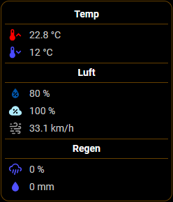
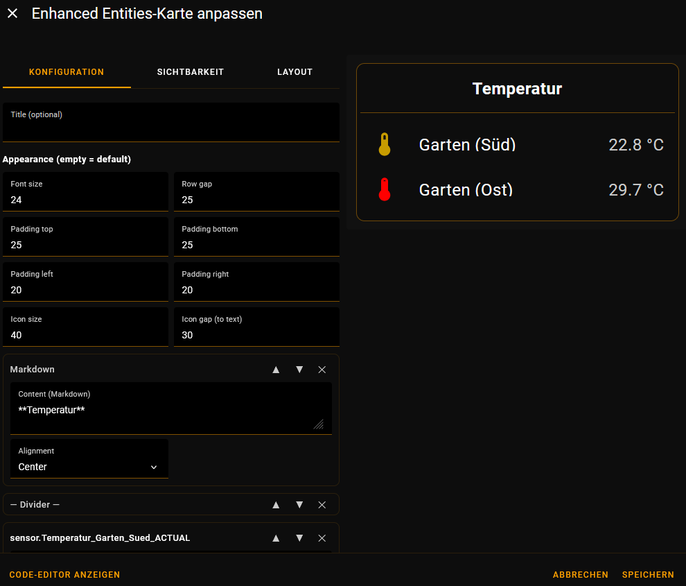
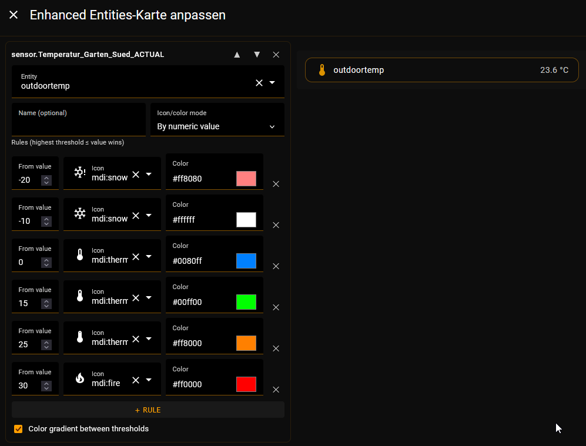
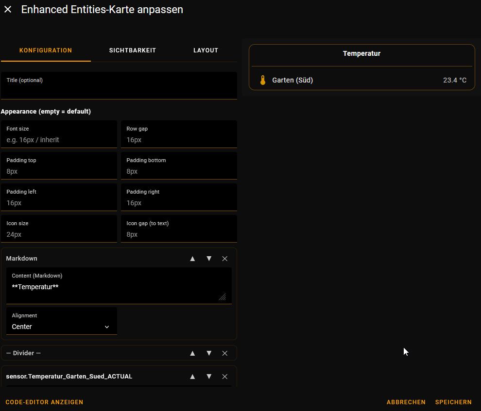
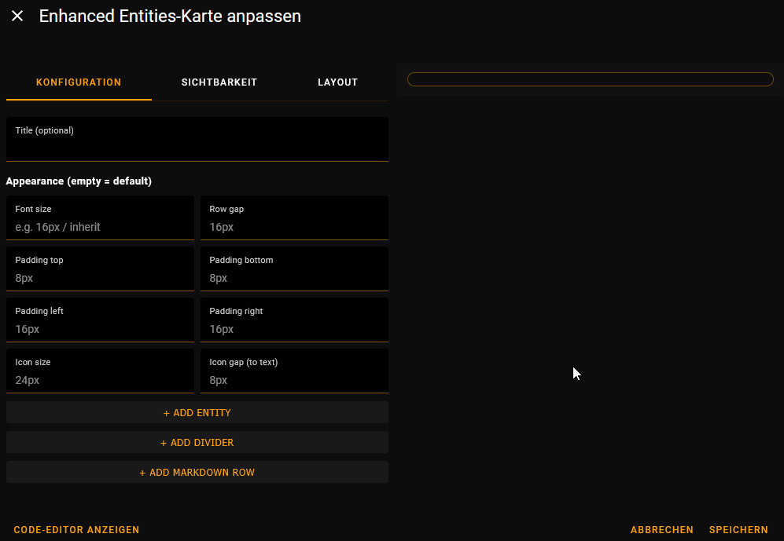

# Enhanced Entities Card

A drop-in replacement for the stock Lovelace **Entities** card, with per‑row icon
colors, state‑dependent icons and colors, numeric thresholds with optional color
gradients, divider and markdown rows, per‑row tap actions, and fully adjustable
spacing — all editable in a visual GUI editor.

Built for the **ioBroker Lovelace adapter**, and also runs in **Home Assistant**.

> **Version:** 0.9.3.0 · **Author:** Björn Müller · registers in the dashboard
> *Add card* picker as **“Enhanced Entities Card”**.

<p align="center">
  
</p>

<p align="center">
  <em>A card built with Enhanced Entities Card: centered markdown section headers,
  dividers, state‑colored icons and inline values (no label → value next to the icon).</em>
</p>

## Features

- **Static icon color** per row (`icon_color`).
- **State‑dependent icon and color** via a true/false map or numeric thresholds.
  True/false maps also match `on/off`, `1/0` and `yes/no` (case‑insensitive).
- **Color gradient** — linear RGB interpolation of the icon color between numeric
  threshold colors (e.g. 20 = yellow, 30 = red → 25 = orange).
- **Inline value** — omit or blank the `name` and the value is shown right next to
  the icon instead of right‑aligned.
- **Per‑row tap action** — `more-info` (default), `toggle`, or `none` (read‑only).
- **Hide the value text** per row (`hide_state`), e.g. for pure toggle switches.
- **Icon on the right** per row (`icon_position: right`).
- **Divider rows** (`type: divider`) and **markdown rows** (`type: markdown`) that
  can be reordered in the editor just like entities. Markdown supports live
  `{iobroker.object.id}` templates and optional alignment.
- **Global appearance options** — font size, row gap, paddings, icon size and the
  icon‑to‑text gap.
- **Visual GUI editor** with entity search (`ha-entity-picker`), icon search
  (`ha-icon-picker`), color pickers and per‑row move/delete controls.

## Installation

The card is a single JavaScript file, `enhanced-entities-card.js`.

### ioBroker (Lovelace adapter) — recommended

This is what the card was built for. You just drop the file into the adapter’s custom
cards — no manual resource entry is required.

1. **Download `enhanced-entities-card.js`** from this repository (the file in the repo
   root, or from a release).
2. In **ioBroker Admin**, open the **Lovelace adapter’s instance settings**, go to the
   **“Custom cards”** tab, and **drag the `.js` file into the drop area**.

   *Alternatively, on the ioBroker host:*

   ```bash
   iobroker file write ./enhanced-entities-card.js /lovelace.0/cards/
   ```

3. **Restart the Lovelace instance.** On restart the adapter automatically registers
   every custom card — you do **not** need to edit any resource list. It is then served
   as `/cards/enhanced-entities-card.js` (type `module`).
4. In your dashboard, switch to **Edit dashboard → Add card** and pick **Enhanced
   Entities Card**. Or add it in YAML:

   ```yaml
   type: custom:enhanced-entities-card
   title: Living room
   entities:
     - entity: light.floor_lamp
       icon: mdi:lamp
       icon_color: "#ffa000"
       action: toggle
   ```

> **Updating:** drop the new file in again and restart the instance. If a browser still
> shows the old version, hard‑reload it (Ctrl/Cmd + Shift + R).

### Home Assistant

The card also works in Home Assistant; here the resource is registered manually.

1. Copy `enhanced-entities-card.js` into your `config/www/` folder. If you just created
   `www`, **restart Home Assistant** so the file is served — it is then available at
   `/local/enhanced-entities-card.js`.
2. Go to **Settings → Dashboards**, open the **⋮ menu (top‑right) → Resources**, then
   **Add resource** with URL `/local/enhanced-entities-card.js` and resource type
   **JavaScript Module**. If you don’t see *Resources*, enable **Advanced Mode** in your
   user profile.

   For YAML‑mode dashboards, add it under `lovelace:` in `configuration.yaml` instead:

   ```yaml
   resources:
     - url: /local/enhanced-entities-card.js
       type: module
   ```

3. Refresh Home Assistant (hard‑reload the browser), then add the card via
   **Add card → Enhanced Entities Card**.

> The only environment‑specific feature is markdown templating (see
> [Special rows](#special-rows)): ioBroker uses `{iobroker.object.id}` placeholders,
> Home Assistant uses Jinja `{{ ... }}`.

### HACS (custom repository)

**HACS → Frontend → ⋮ → Custom repositories** → add this repository’s URL with
category **Lovelace/Dashboard**, then install as usual. A `hacs.json` is included.

## Configuration

Add the card through the **visual editor** (recommended) or in YAML with
`type: custom:enhanced-entities-card`.

### Card options

| Option          | Type     | Default   | Description |
| --------------- | -------- | --------- | ----------- |
| `entities`      | list     | *required* | Rows to display (entity rows and/or special rows). |
| `title`         | string   | –         | Optional card header. |
| `font_size`     | length   | inherit   | Font size for the whole card. |
| `row_gap`       | length   | `16px`    | Vertical gap between rows. |
| `padding_top`   | length   | `8px`     | Inner top padding. |
| `padding_bottom`| length   | `8px`     | Inner bottom padding. |
| `padding_left`  | length   | `16px`    | Inner left padding. |
| `padding_right` | length   | `16px`    | Inner right padding. |
| `icon_size`     | length   | `24px`    | Icon box size. |
| `icon_gap`      | length   | `8px`     | Gap between icon and text (half the stock 16px). |

> **Length values:** a plain number is treated as pixels (`8` → `8px`); you may also
> pass any CSS unit (`1.2em`, `12pt`). Leave empty for the default.



*The **Appearance** section controls the global options. Here they are pushed up
(font size 24, row gap 25, icon size 40, icon gap 30) — the live preview on the right
updates instantly.*

### Entity row options

| Option          | Type                    | Default            | Description |
| --------------- | ----------------------- | ------------------ | ----------- |
| `entity`        | string                  | *required*         | Entity / datapoint ID. |
| `name`          | string                  | entity’s name      | Row label. **Omit or set to blank** to show the value inline, right next to the icon. |
| `icon`          | string \| map \| list   | entity’s icon      | Static icon, a state map, or numeric thresholds (see below). |
| `icon_color`    | string \| map \| list   | theme default      | Static color, a state map, or numeric thresholds. |
| `color_gradient`| boolean                 | `false`            | Interpolate the icon color between numeric threshold colors. |
| `action`        | string                  | `more-info`        | Tap behavior: `more-info`, `toggle`, or `none`. |
| `hide_state`    | boolean                 | `false`            | Hide the value text. |
| `icon_position` | string                  | `left`             | `left` or `right` (icon at the far right; the icon gap moves to the icon side). |

### State‑dependent icons and colors

`icon` and `icon_color` accept three forms:

**1. Static** — a single value:

```yaml
- entity: switch.foo
  icon: mdi:lightbulb
  icon_color: "#ffa000"
```

**2. State map** — one value per state. Keys `true`/`false` also match `on`/`off`,
`1`/`0` and `yes`/`no` (case‑insensitive):

```yaml
- entity: binary_sensor.door
  icon:       { "true": mdi:door-open, "false": mdi:door }
  icon_color: { "true": "#43a047",     "false": "#e53935" }
```

**3. Numeric thresholds** — a list of `{ value, icon|color }`; the **highest
threshold that is ≤ the current value wins**:

```yaml
- entity: sensor.temperature
  name: Temperature
  icon:
    - { value: -50, icon: mdi:snowflake }
    - { value: 18,  icon: mdi:thermometer }
    - { value: 25,  icon: mdi:fire }
  icon_color:
    - { value: -50, color: "#1e88e5" }
    - { value: 18,  color: "#fb8c00" }
    - { value: 25,  color: "#e53935" }
```



*Per‑row threshold editor: one rule per breakpoint (icon + color), with a live
preview. Ticking **Color gradient between thresholds** blends the colors smoothly.*

### Color gradient

Set `color_gradient: true` on a row that uses numeric `icon_color` thresholds. The
icon color is then interpolated linearly (in RGB) between the two surrounding
threshold colors; below the lowest / above the highest threshold the edge color is
used. Requires **hex** colors — non‑hex values (CSS names, `var()`) fall back to the
stepped behavior.

```yaml
- entity: sensor.temperature
  color_gradient: true
  icon_color:
    - { value: 20, color: "#ffeb3b" }   # yellow
    - { value: 30, color: "#e53935" }   # red  → 25 renders as orange
```

### Special rows

Both can be reordered, added and removed in the GUI editor like any entity.

| Row              | Description |
| ---------------- | ----------- |
| `type: divider`  | A 1px line in the card’s border color, with a fixed 5px side gap. |
| `type: markdown` | Markdown text from `content`; optional `align: left` (default) / `center` / `right`; fixed 10px side gap; rendered via the stock `ha-markdown`. |



*A markdown header (centered), a divider and an entity row combined — exactly the
layout that produces the sectioned card at the top of this page.*

**Templates in markdown rows:** on the ioBroker Lovelace adapter, use
`{namespace.object.id}` placeholders — they update live, just like the stock
markdown card:

```yaml
- type: markdown
  content: "#### {open-meteo-weather.0.Home.weather.forecast.day0.weather_text}"
  align: center
```

In real Home Assistant there are no `{iobroker.id}` datapoints — use standard Jinja
templates instead, e.g. `{{ states('sensor.temperature') }}`.

### Full example

```yaml
type: custom:enhanced-entities-card
title: Example
font_size: 14px
row_gap: 8
entities:
  - type: markdown
    content: "**Temperatures**"
    align: center
  - entity: switch.foo
    name: Static
    icon: mdi:lightbulb
    icon_color: "#ffa000"
  - type: divider
  - entity: binary_sensor.door
    name: By true/false
    icon:       { "true": mdi:door-open, "false": mdi:door }
    icon_color: { "true": "#43a047",     "false": "#e53935" }
  - entity: sensor.temperature
    name: By numeric value          # highest threshold <= value wins
    color_gradient: true
    icon:
      - { value: -50, icon: mdi:snowflake }
      - { value: 18,  icon: mdi:thermometer }
      - { value: 25,  icon: mdi:fire }
    icon_color:
      - { value: -50, color: "#1e88e5" }
      - { value: 18,  color: "#fb8c00" }
      - { value: 25,  color: "#e53935" }
  - entity: light.desk
    icon: mdi:desk-lamp             # no name -> value shown inline next to the icon
    action: toggle
    hide_state: true
    icon_position: right
```

## GUI editor

The card ships with a full visual editor (`enhanced-entities-card-editor`), so it can
be configured entirely without YAML:



- Entity rows with datapoint search (`ha-entity-picker`) and icon search
  (`ha-icon-picker`) for every icon field.
- Per‑field mode selector: static / boolean map / numeric thresholds, with color
  pickers plus hex input, and add/remove for threshold rules.
- Buttons to add **entity**, **divider** and **markdown** rows; every row can be
  moved (▲▼) or deleted.
- An **Appearance** section for the global options above.

If the picker elements are not available for some reason, the editor falls back to
plain text inputs, so it always stays usable.

## Compatibility notes

- The card renders in the **light DOM**, so all configurable values are applied as
  inline styles. This keeps multiple instances on the same page independent of each
  other.
- Markdown templating is the only environment‑specific part: `{iobroker.id}`
  placeholders on ioBroker vs. Jinja `{{ ... }}` in Home Assistant.

## Versioning

The project is in a pre‑1.0 line (`0.9.x`). Config option names are kept backward
compatible; see [CHANGELOG.md](CHANGELOG.md) for the history.

## License

Released under the **MIT License** — see [LICENSE](LICENSE).

## Author

Björn Müller · <bjoern@mueller.family>
